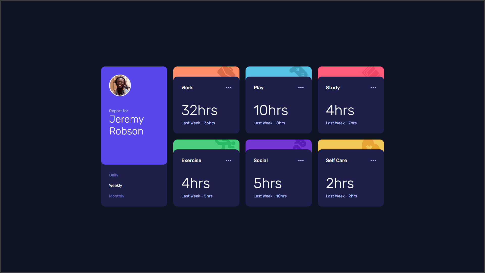

# Frontend Mentor - Time tracking dashboard solution

This is a solution to the [Time tracking dashboard challenge on Frontend Mentor](https://www.frontendmentor.io/challenges/time-tracking-dashboard-UIQ7167Jw). Frontend Mentor challenges help you improve your coding skills by building realistic projects. 

## Table of contents

- [Overview](#overview)
  - [The challenge](#the-challenge)
  - [Screenshot](#screenshot)
  - [Links](#links)
- [My process](#my-process)
  - [Built with](#built-with)
  - [What I learned](#what-i-learned)
- [Author](#author)

## Overview

### The challenge

Users should be able to:

- View the optimal layout for the site depending on their device's screen size
- See hover states for all interactive elements on the page
- Switch between viewing Daily, Weekly, and Monthly stats

### Screenshot

### Links

- Live Site URL: [https://time-tracking-dashboard-taki.vercel.app/](https://time-tracking-dashboard-taki.vercel.app/)

## My process

### Built with

- Semantic HTML5 markup
- CSS custom properties
- Flexbox
- CSS Grid
- JavaScript events
- Fetch JSON data
- Desktop-first workflow

### What I learned

I learn how to fetch data from a `JSON` file, how to handle asyncrounous code using `async` and `await` and how to work with `Promises` as well.

## Author

- LinkedIn - [Youssef TAKI](https://www.linkedin.com/in/youssef-taki-tech)
- Frontend Mentor - [@YoussefTK35](https://www.frontendmentor.io/profile/YoussefTK35)
